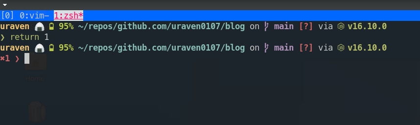

# Starship使い始めました。

[Starship](https://starship.rs/ja-JP/)を使い始めました。<br>
Starshipはプロンプトのカスタマイズ用のプラグインで、カスタマイズ性の高さが売りのようです。<br>
公式のドキュメントに日本語があり、インストール〜設定までかなり簡単にできました。<br>
プロンプトは前まで、[p10k](https://github.com/romkatv/powerlevel10k)を使っていたのですが、あまりメリットを感じられなかったので軽そうなStarshipに乗り換えました。

## インストール〜設定

インストールは、[公式](https://starship.rs/ja-JP/guide/#%F0%9F%9A%80-%E3%82%A4%E3%83%B3%E3%82%B9%E3%83%88%E3%83%BC%E3%83%AB)に従って貰えればスムーズにできると思います。<br>
一点、注意があって[Nerd Font](https://www.nerdfonts.com)がインストール済みで、ターミナルのフォントとして設定されていないと表示崩れが起きるようです。<br>
p10kでもNerd Fontを使っていたので私のalacrittyは設定済みでスルーできましたが、注意が必要そうです。<br>

### インストール(zsh)
zshでのインストール方法を軽く載せます。

- バイナリインストール

```
sh -c "$(curl -fsSL https://starship.rs/install.sh)"
```

- `~/.zshrc`の最後の行に以下を追加

```
eval "$(starship init zsh)"
```

brewとかscoopとかならパッケージをインストールできるようです。<br>
私はMac持っていないし、windowsもありますが開発機では無いので使っていませんが。<br>


- 設定ファイル作成

```
mkdir -p ~/.config && touch ~/.config/starship.toml
```
mkdirはお好みで。<br>
設定ファイルが無くてもデフォルトでいい感じのプロンプトになっています。<br>
設定についても[公式](https://starship.rs/ja-JP/config/)を見てもらうのが一番いいと思います。<br>
パスがtruncateされたり、バッテリーが10%以下じゃないと表示されない等々、デフォルトだと使いづらい部分もあったので、少し設定し直しました。<br>

```
format = "$username$hostname$battery$all"   # プロンプトの表示順を変更
add_newline = false   # プロンプトの上に空行を入れない

[[battery.display]]   # バッテリーの設定
threshold = 100   # バッテリー残量100%以下で表示
style = "bold bright-green"   # 表示色変更

[directory]   # ディレクトリの設定
truncate_to_repo = false   # gitのリポジトリの場合リポジトリのルートから表示されてしまうのでfalseに
truncation_length = 10   # パスのtruncateを10階層以上で有効化する

[package]   # パッケージ情報
disabled = true   # パッケージ情報を非表示

[status]   # 前回実行したコマンドのステータス
disabled = false   # ステータスを表示する

[username]   # ユーザー名
show_always = true   # 常に表示する
format = "[$user]($style) 🍙 "   # ユーザー名のフォーマット
```

上記の設定だと以下のようなプロンプトになります。<br>



<br>
詳しい説明は割愛しますが、色々設定できるので試してみてください。

# 使ってみての感想

まだ使い始めてすぐにこの記事を書いているのですが、以前まで使っていたp10kと比べると設定の記述がかなりシンプルなので自分好みにカスタマイズしやすいように思えます。<br>
p10kは設定を書くファイルがzshファイル内部だったので設定とロジックが同居しており、かなりとっつき辛い感じがありましたが、Starshipは設定のみ記述できるので分かりやすいです。<br>
しばらくは使ってみようと思います。<br>
zinit使っているけどプラグインどんどん減らしていっているし、zinitの恩恵が薄い気がしてきた。<br>
